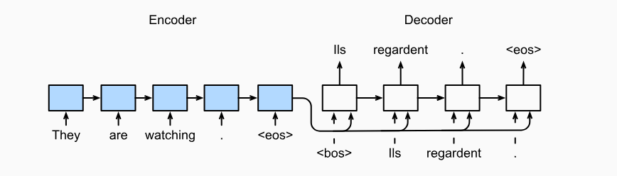

## **Encoder Decoder Network**

An **Encoder-Decoder network** is a type of neural network architecture commonly used for sequence-to-sequence (Seq2Seq) tasks like machine translation, text summarization, and question-answering. It consists of two main components: an **encoder** and a **decoder**. Both components are typically recurrent neural networks (RNNs), and in this explanation, we will use **Long Short-Term Memory (LSTM)** layers for both the encoder and decoder. LSTMs are a type of RNN that can handle long-range dependencies by mitigating the vanishing gradient problem.

Let's break down the **What, Why, When, and How** of the encoder-decoder network using LSTM layers.

---

### 1. **What is an Encoder-Decoder Network?**

An **Encoder-Decoder network** is a neural network designed to map input sequences to output sequences. It consists of:

- **Encoder:** Processes the input sequence and compresses it into a context vector (also called the hidden state or thought vector).
- **Decoder:** Takes the context vector and generates the output sequence.

In the case of using LSTMs, the encoder and decoder are stacks of LSTM cells that learn temporal dependencies in the data.

---

### 2. **Why Use an Encoder-Decoder Network?**

The encoder-decoder architecture is well-suited for tasks where the input and output lengths differ and where order and temporal dependencies matter. 

- **Machine Translation:** Sentence lengths may vary across languages.
- **Text Summarization:** Input (document) may be long, while output (summary) is short.
- **Speech Recognition:** The input (audio frames) might have a different length than the output (text).

LSTMs are used because they efficiently handle sequences, especially those with long-term dependencies. The gating mechanism inside LSTMs helps them retain or forget information over long time periods, which is crucial for accurately translating or summarizing sequences.

---

### 3. **When to Use Encoder-Decoder Networks?**

The encoder-decoder architecture is ideal when:
- The input and output sequences have variable lengths.
- The task requires understanding the context and temporal dependencies within the input sequence (like translation or summarization).
- The output is generated step by step, where each output at time `t` depends on previous outputs at `t-1` and the full input sequence.

---

### 4. **How Does an Encoder-Decoder Network Work?**

Let's break the working down step-by-step, with an example task of translating an English sentence to French using LSTM-based encoder-decoder architecture.

#### Step 1: **Encoder (LSTM Layers)**

- **Input:** A sequence of words (or tokens) in English, e.g., `["I", "am", "learning", "deep", "learning"]`.
- **Processing:**
    - Each word is embedded into a vector using word embeddings (e.g., word2vec, GloVe).
    - The sequence of word embeddings is fed into the LSTM encoder, which processes the sequence one time step at a time.
    - The LSTM keeps an internal memory of previous words using its cell state and hidden state. The forget gate, input gate, and output gate in the LSTM cells allow it to decide what information to keep or discard.
    - At the last time step (the word "learning"), the encoder outputs a **context vector**, which is a compressed representation of the entire input sentence. This context vector contains the LSTM's hidden state and cell state at the final time step.

    **Mathematically:**

    For an input sequence `x = [x1, x2, ..., xT]`, the LSTM computes hidden states `h_t` and cell states `c_t` at each time step:

    \[
    h_t, c_t = \text{LSTM}(x_t, h_{t-1}, c_{t-1})
    \]

    The final context vector is the hidden state from the last time step: `h_T`.

#### Step 2: **Decoder (LSTM Layers)**

- **Input:** The context vector from the encoder and an initial start token `<sos>` (start of sentence) for the French sequence.
- **Processing:**
    - The decoder is another LSTM network that generates the output sequence one word at a time.
    - At each time step, the decoder takes in the previous word's embedding (starting with `<sos>`) and the context vector (from the encoder).
    - It outputs a predicted word, and this word is fed back into the decoder for the next time step.
    - The process continues until the decoder generates the `<eos>` (end of sentence) token, signaling the end of the translation.

    **Mathematically:**

    For each step `t` in the output sequence:

    \[
    h'_t, c'_t = \text{LSTM}(y_{t-1}, h'_{t-1}, c'_{t-1})
    \]

    Where `y_{t-1}` is the previous word (starting with `<sos>`).

- **Final Output:** A sequence of French words, e.g., `["Je", "suis", "en", "train", "d'apprendre", "l'apprentissage", "profond"]`.

#### Step 3: **Training the Network**

During training, both the encoder and decoder LSTMs are trained jointly using a loss function such as **cross-entropy loss**. The model learns to predict the correct sequence of output words given the input sequence. This process involves backpropagating through time (BPTT) to update the weights of the LSTMs.

---

### 5. **Detailed Example: Translating English to French**

Assume we have the sentence:
- Input (English): `"I am learning deep learning"`
- Target (French): `"Je suis en train d'apprendre l'apprentissage profond"`

#### Encoder Step-by-Step:

1. **Embedding Layer:** Convert the input English sentence into embeddings:
   - `I -> [0.21, 0.68, ...]`
   - `am -> [0.43, 0.77, ...]`
   - `learning -> [0.55, 0.42, ...]`
   
2. **LSTM Cells in Encoder:** Process the embeddings through the LSTM layer sequentially. The LSTM cell updates its hidden and cell state for each word.

3. **Context Vector:** After processing all the words, the final hidden state (context vector) might look like this: `h_T = [0.45, 0.37, ...]`.

#### Decoder Step-by-Step:

1. **Initial Input:** The context vector from the encoder and the start token `<sos>`.
2. **First Word:** The decoder predicts the first word in the French sentence, `Je`.
3. **Next Step:** The predicted word `Je` is fed back into the decoder, along with the context vector, to predict the next word, `suis`.
4. **Repeat:** The process continues until the end token `<eos>` is predicted, signaling that the translation is complete.

---

### 6. **Summary:**

- **Encoder-Decoder Architecture** is designed for sequence-based tasks, especially where input and output lengths differ.
- **LSTM Layers** help in maintaining long-term dependencies, which is essential for context-sensitive tasks like translation.
- The **encoder** compresses the input into a context vector, and the **decoder** generates the output sequence word-by-word.
- LSTMs use gates to regulate the flow of information, making them ideal for tasks with temporal dependencies.

This architecture is highly flexible and can be adapted for various applications such as machine translation, image captioning, and more.
