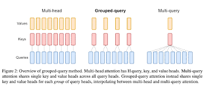
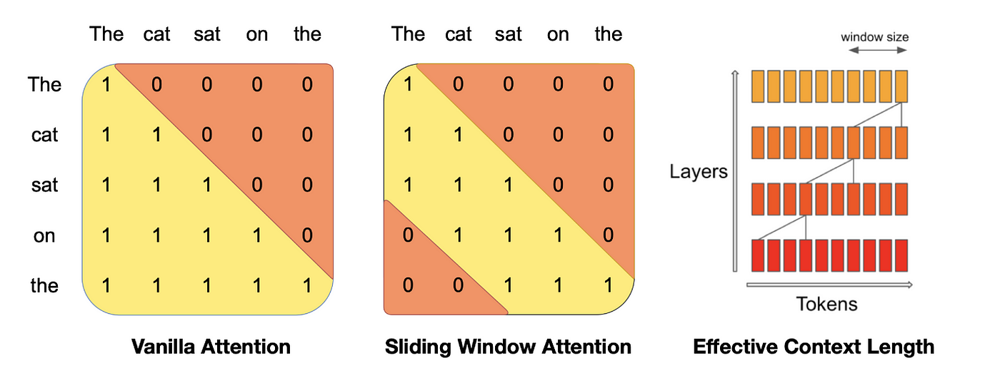
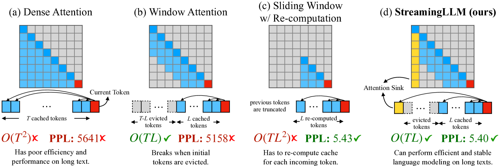
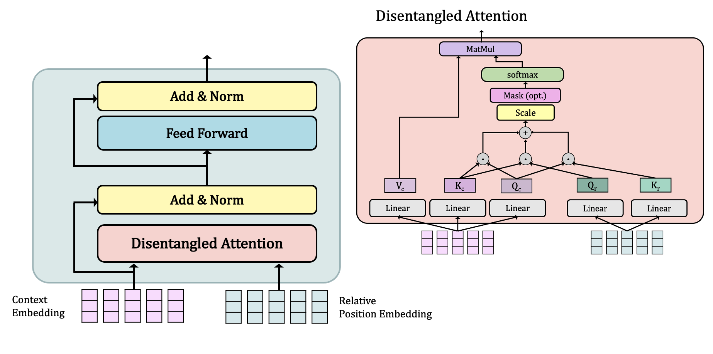

# MultiHead Attention



## 1. What is MultiHead Attention?

MultiHead Attention is a key component of transformer architectures, introduced in the paper "Attention Is All You Need" by Vaswani et al. It extends the idea of attention by allowing the model to jointly attend to information from different representation subspaces at different positions.

## 2. Mathematical Formulation

MultiHead Attention is defined as:

$MultiHead(Q, K, V) = Concat(head_1, ..., head_h)W^O$

Where each head is computed as:

$head_i = Attention(QW_i^Q, KW_i^K, VW_i^V)$

The Attention function is typically scaled dot-product attention:

$Attention(Q, K, V) = softmax(\frac{QK^T}{\sqrt{d_k}})V$

Where:
- $Q$, $K$, and $V$ are query, key, and value matrices
- $W_i^Q$, $W_i^K$, $W_i^V$ are learned projection matrices for each head
- $W^O$ is the output projection matrix
- $d_k$ is the dimension of the keys

## 3. Why use MultiHead Attention?

- Parallel processing: Multiple attention heads can be computed simultaneously
- Diverse feature capture: Different heads can focus on different aspects of the input
- Improved representation: Allows the model to attend to information from different subspaces
- Enhanced performance: Often leads to better results than single-head attention

## 4. How does MultiHead Attention work?

1. Linear projections: Project Q, K, and V into h different subspaces
2. Attention computation: Apply scaled dot-product attention for each head
3. Concatenation: Concatenate the outputs of all heads
4. Final projection: Apply a final linear projection to the concatenated output

## 5. Detailed Code Implementation

Here's a comprehensive implementation of MultiHead Attention, including visualization:

```python
import torch
import torch.nn as nn
import matplotlib.pyplot as plt
import seaborn as sns

class MultiHeadAttention(nn.Module):
    def __init__(self, d_model, num_heads, dropout=0.1):
        super().__init__()
        self.d_model = d_model
        self.num_heads = num_heads
        self.head_dim = d_model // num_heads
        
        self.q_proj = nn.Linear(d_model, d_model)
        self.k_proj = nn.Linear(d_model, d_model)
        self.v_proj = nn.Linear(d_model, d_model)
        self.out_proj = nn.Linear(d_model, d_model)
        
        self.dropout = nn.Dropout(dropout)
        
    def forward(self, q, k, v, mask=None):
        batch_size = q.size(0)
        
        q = self.q_proj(q).view(batch_size, -1, self.num_heads, self.head_dim).transpose(1, 2)
        k = self.k_proj(k).view(batch_size, -1, self.num_heads, self.head_dim).transpose(1, 2)
        v = self.v_proj(v).view(batch_size, -1, self.num_heads, self.head_dim).transpose(1, 2)
        
        attn_scores = torch.matmul(q, k.transpose(-2, -1)) / (self.head_dim ** 0.5)
        
        if mask is not None:
            attn_scores = attn_scores.masked_fill(mask == 0, float('-inf'))
        
        attn_probs = self.dropout(torch.softmax(attn_scores, dim=-1))
        
        out = torch.matmul(attn_probs, v).transpose(1, 2).contiguous().view(batch_size, -1, self.d_model)
        return self.out_proj(out)
    
    def visualize_attention(self, attn_weights, head_idx=0):
        fig, ax = plt.subplots(figsize=(10, 8))
        sns.heatmap(attn_weights[0, head_idx].detach().cpu().numpy(), ax=ax, cmap='viridis')
        ax.set_title(f"Attention Weights for Head {head_idx + 1}")
        ax.set_xlabel("Key Position")
        ax.set_ylabel("Query Position")
        plt.show()

if __name__ == "__main__":

    d_model = 512
    num_heads = 8
    mha = MultiHeadAttention(d_model, num_heads)

    seq_len = 100
    x = torch.randn(32, seq_len, d_model)
    output = mha(x, x, x)

    print(f"Input shape: {x.shape}")
    print(f"Output shape: {output.shape}")

    with torch.no_grad():
        q = mha.q_proj(x).view(32, seq_len, num_heads, -1).transpose(1, 2)
        k = mha.k_proj(x).view(32, seq_len, num_heads, -1).transpose(1, 2)
        attn_weights = torch.softmax(torch.matmul(q, k.transpose(-2, -1)) / (mha.head_dim ** 0.5), dim=-1)

    mha.visualize_attention(attn_weights)
```

## 6. Pros of MultiHead Attention

1. Parallel processing: Efficient computation of multiple attention heads
2. Diverse feature capture: Different heads can focus on different aspects of the input
3. Improved representation: Allows the model to attend to information from different subspaces
4. Enhanced performance: Often leads to better results than single-head attention
5. Flexibility: Number of heads can be adjusted based on the task requirements

## 7. Cons of MultiHead Attention

1. Increased complexity: More parameters and computations compared to single-head attention
2. Potential redundancy: Some heads may learn similar patterns
3. Interpretability challenges: Understanding the role of each head can be difficult
4. Memory intensive: Requires storing intermediate results for each head
5. Hyperparameter sensitivity: Performance may depend on the number of heads chosen

## 8. Comparison with Other Methods

- vs. Single-Head Attention: MultiHead Attention offers more diverse feature capture and often better performance, but at the cost of increased complexity
- vs. Multi-Query Attention: MultiHead Attention uses separate projections for queries, keys, and values, while Multi-Query Attention shares key and value projections across heads
- vs. Grouped-Query Attention: MultiHead Attention has individual projections for each head, while Grouped-Query Attention groups heads to share some projections
- vs. Sliding Window Attention: MultiHead Attention attends to the entire sequence, while Sliding Window Attention focuses on local contexts
- vs. Disentangled Attention: MultiHead Attention uses a single attention mechanism per head, while Disentangled Attention separates content-based and position-based attention

MultiHead Attention is a versatile and powerful mechanism that forms the backbone of many transformer architectures. Its ability to capture diverse features and process information in parallel has made it a popular choice in various natural language processing and computer vision tasks.


# Multi-Query Attention

## 1. What is Multi-Query Attention?

Multi-Query Attention is a variation of MultiHead Attention that aims to reduce computational and memory requirements while maintaining performance. It was introduced in the paper "Fast Transformer Decoding: One Write-Head is All You Need" by Shazeer et al.

## 2. Mathematical Formulation

Multi-Query Attention is defined as:

$MultiQueryAttention(Q, K, V) = Concat(head_1, ..., head_h)W^O$

Where each head is computed as:

$head_i = Attention(Q_iW^Q, KW^K, VW^V)$

The key difference from MultiHead Attention is that $K$ and $V$ are shared across all heads, while $Q$ is different for each head.

## 3. Why use Multi-Query Attention?

- Reduced memory usage: Fewer parameters compared to MultiHead Attention
- Faster inference: Shared key and value projections lead to more efficient computation
- Comparable performance: Often achieves similar results to MultiHead Attention
- Improved throughput: Especially beneficial for autoregressive decoding tasks

## 4. How does Multi-Query Attention work?

1. Query projection: Project Q into h different subspaces
2. Shared key and value projections: Project K and V once, shared across all heads
3. Attention computation: Apply scaled dot-product attention for each head
4. Concatenation: Concatenate the outputs of all heads
5. Final projection: Apply a final linear projection to the concatenated output

## 5. Detailed Code Implementation

Here's a comprehensive implementation of Multi-Query Attention, including visualization:

```python
import torch
import torch.nn as nn
import matplotlib.pyplot as plt
import seaborn as sns

class MultiQueryAttention(nn.Module):
    def __init__(self, d_model, num_heads, dropout=0.1):
        super().__init__()
        self.d_model = d_model
        self.num_heads = num_heads
        self.head_dim = d_model // num_heads
        
        self.q_proj = nn.Linear(d_model, d_model)
        self.kv_proj = nn.Linear(d_model, 2 * d_model)
        self.out_proj = nn.Linear(d_model, d_model)
        
        self.dropout = nn.Dropout(dropout)
        
    def forward(self, q, kv, mask=None):
        batch_size = q.size(0)
        
        q = self.q_proj(q).view(batch_size, -1, self.num_heads, self.head_dim).transpose(1, 2)
        k, v = self.kv_proj(kv).chunk(2, dim=-1)
        k = k.reshape(batch_size, -1, 1, self.head_dim).expand(-1, -1, self.num_heads, -1).transpose(1, 2)
        v = v.reshape(batch_size, -1, 1, self.head_dim).expand(-1, -1, self.num_heads, -1).transpose(1, 2)
        
        attn_scores = torch.matmul(q, k.transpose(-2, -1)) / (self.head_dim ** 0.5)
        
        if mask is not None:
            attn_scores = attn_scores.masked_fill(mask == 0, float('-inf'))
        
        attn_probs = self.dropout(torch.softmax(attn_scores, dim=-1))
        
        out = torch.matmul(attn_probs, v).transpose(1, 2).contiguous().view(batch_size, -1, self.d_model)
        return self.out_proj(out)
    
    def visualize_attention(self, attn_weights, head_idx=0):
        fig, ax = plt.subplots(figsize=(10, 8))
        sns.heatmap(attn_weights[0, head_idx].detach().cpu().numpy(), ax=ax, cmap='viridis')
        ax.set_title(f"Attention Weights for Head {head_idx + 1}")
        ax.set_xlabel("Key Position")
        ax.set_ylabel("Query Position")
        plt.show()

if __name__ == "__main__":

    d_model = 512
    num_heads = 8
    mqa = MultiQueryAttention(d_model, num_heads)

    seq_len = 100
    x = torch.randn(32, seq_len, d_model)  
    output = mqa(x, x)

    print(f"Input shape: {x.shape}")
    print(f"Output shape: {output.shape}")

    with torch.no_grad():
        q = mqa.q_proj(x).view(32, seq_len, num_heads, -1).transpose(1, 2)  
        k, _ = mqa.kv_proj(x).chunk(2, dim=-1)  
        k = k.view(32, seq_len, num_heads, -1).transpose(1, 2)  
        
        attn_weights = torch.softmax(torch.matmul(q, k.transpose(-2, -1)) / (mqa.head_dim ** 0.5), dim=-1)

    mqa.visualize_attention(attn_weights)
```

## 6. Pros of Multi-Query Attention

1. Reduced memory usage: Fewer parameters compared to MultiHead Attention
2. Faster inference: Shared key and value projections lead to more efficient computation
3. Comparable performance: Often achieves similar results to MultiHead Attention
4. Improved throughput: Especially beneficial for autoregressive decoding tasks
5. Simplified architecture: Fewer projection matrices to manage

## 7. Cons of Multi-Query Attention

1. Potential loss of expressiveness: Sharing key and value projections may limit the model's capacity
2. Less flexibility: Cannot have specialized key and value projections for each head
3. Training challenges: May require careful tuning of learning rates and other hyperparameters
4. Limited applicability: Most beneficial in specific scenarios, such as autoregressive decoding
5. Interpretability: Understanding the role of shared projections can be challenging

## 8. Comparison with Other Methods

- vs. MultiHead Attention: Multi-Query Attention reduces memory usage and improves inference speed, but may sacrifice some expressiveness
- vs. Grouped-Query Attention: Multi-Query Attention shares all key and value projections, while Grouped-Query Attention allows for some specialization within groups
- vs. Sliding Window Attention: Multi-Query Attention still attends to the entire sequence, while Sliding Window Attention focuses on local contexts
- vs. Disentangled Attention: Multi-Query Attention uses a single attention mechanism with shared components, while Disentangled Attention separates content-based and position-based attention

Multi-Query Attention offers a compelling trade-off between efficiency and performance, making it particularly suitable for scenarios where memory and computational resources are constrained, or where fast autoregressive decoding is crucial.

# Grouped Query Attention

## 1. What is Grouped Query Attention?

Grouped Query Attention (GQA) is an extension of Multi-Query Attention that aims to balance the efficiency gains of MQA with the expressiveness of full MultiHead Attention. It was introduced in the paper "GQA: Training Generalized Multi-Query Transformer Models from Multi-Head Checkpoints" by Ainslie et al.

## 2. Mathematical Formulation

Grouped Query Attention is defined as:

$GQA(Q, K, V) = Concat(group_1, ..., group_g)W^O$

Where each group is computed as:

$group_i = Concat(head_{i,1}, ..., head_{i,h/g})$
$head_{i,j} = Attention(Q_{i,j}W^Q_{i,j}, KW^K_i, VW^V_i)$

Where:
- $g$ is the number of groups
- $h$ is the total number of heads
- $h/g$ is the number of heads per group

## 3. Why use Grouped Query Attention?

- Balanced approach: Combines benefits of MultiHead and Multi-Query Attention
- Improved efficiency: Reduces memory usage compared to full MultiHead Attention
- Maintained expressiveness: Allows for some specialization of key and value projections
- Flexible configuration: Number of groups can be adjusted based on task requirements
- Compatibility: Can be initialized from pretrained MultiHead Attention models

## 4. How does Grouped Query Attention work?

1. Group definition: Divide attention heads into groups
2. Query projections: Compute separate query projections for each head
3. Grouped key and value projections: Compute shared key and value projections for each group
4. Attention computation: Apply scaled dot-product attention for each head within its group
5. Concatenation: Concatenate the outputs of all heads
6. Final projection: Apply a final linear projection to the concatenated output

## 5. Detailed Code Implementation

Here's a comprehensive implementation of Grouped Query Attention, including visualization:

```python
import torch
import torch.nn as nn
import matplotlib.pyplot as plt
import seaborn as sns

class GroupedQueryAttention(nn.Module):
    def __init__(self, d_model, num_heads, num_groups, dropout=0.1):
        super().__init__()
        assert num_heads % num_groups == 0, "num_heads must be divisible by num_groups"
        self.d_model = d_model
        self.num_heads = num_heads
        self.num_groups = num_groups
        self.heads_per_group = num_heads // num_groups
        self.head_dim = d_model // num_heads
        
        self.q_proj = nn.Linear(d_model, d_model)
        self.kv_proj = nn.Linear(d_model, 2 * d_model)
        self.out_proj = nn.Linear(d_model, d_model)
        
        self.dropout = nn.Dropout(dropout)
        
    def forward(self, q, kv, mask=None):
        batch_size = q.size(0)
        seq_len = q.size(1)  # Get sequence length
        
        # Project q, k, and v
        q = self.q_proj(q).view(batch_size, seq_len, self.num_heads, self.head_dim).transpose(1, 2)  # [batch_size, num_heads, seq_len, head_dim]
        k, v = self.kv_proj(kv).chunk(2, dim=-1)
        k = k.view(batch_size, seq_len, self.num_heads, self.head_dim).transpose(1, 2)
        v = v.view(batch_size, seq_len, self.num_heads, self.head_dim).transpose(1, 2)
        
        # Group q, k, and v
        q = q.view(batch_size, self.num_groups, self.heads_per_group, seq_len, self.head_dim)
        k = k.view(batch_size, self.num_groups, self.heads_per_group, seq_len, self.head_dim)
        v = v.view(batch_size, self.num_groups, self.heads_per_group, seq_len, self.head_dim)
        
        # Compute attention scores
        attn_scores = torch.matmul(q, k.transpose(-2, -1)) / (self.head_dim ** 0.5)
        
        if mask is not None:
            attn_scores = attn_scores.masked_fill(mask == 0, float('-inf'))
        
        attn_probs = self.dropout(torch.softmax(attn_scores, dim=-1))
        
        # Compute the attention output
        out = torch.matmul(attn_probs, v)
        out = out.transpose(2, 3).contiguous().view(batch_size, seq_len, self.d_model)
        return self.out_proj(out)
    
    def visualize_attention(self, attn_weights, group_idx=0, head_idx=0):
        fig, ax = plt.subplots(figsize=(10, 8))
        sns.heatmap(attn_weights[0, group_idx, head_idx].detach().cpu().numpy(), ax=ax, cmap='viridis')
        ax.set_title(f"Attention Weights for Group {group_idx + 1}, Head {head_idx + 1}")
        ax.set_xlabel("Key Position")
        ax.set_ylabel("Query Position")
        plt.show()


if __name__ == "__main__":
    d_model = 512
    num_heads = 8
    num_groups = 2
    gqa = GroupedQueryAttention(d_model, num_heads, num_groups)

    seq_len = 100
    x = torch.randn(32, seq_len, d_model) 
    output = gqa(x, x)

    print(f"Input shape: {x.shape}")
    print(f"Output shape: {output.shape}")

    with torch.no_grad():
        q = gqa.q_proj(x).view(32, seq_len, gqa.num_heads, gqa.head_dim).transpose(1, 2)  
        k, _ = gqa.kv_proj(x).chunk(2, dim=-1)
        k = k.view(32, seq_len, gqa.num_heads, gqa.head_dim).transpose(1, 2)  #
        q = q.view(32, gqa.num_groups, gqa.heads_per_group, seq_len, gqa.head_dim)
        k = k.view(32, gqa.num_groups, gqa.heads_per_group, seq_len, gqa.head_dim)
        
        attn_weights = torch.softmax(torch.matmul(q, k.transpose(-2, -1)) / (gqa.head_dim ** 0.5), dim=-1)

    gqa.visualize_attention(attn_weights)
```

## 6. Pros of Grouped Query Attention

1. Balanced approach: Combines efficiency of MQA with expressiveness of MultiHead Attention
2. Improved efficiency: Reduces memory usage compared to full MultiHead Attention
3. Maintained expressiveness: Allows for some specialization of key and value projections
4. Flexible configuration: Number of groups can be adjusted based on task requirements
5. Compatibility: Can be initialized from pretrained MultiHead Attention models

## 7. Cons of Grouped Query Attention

1. Increased complexity: More complex implementation compared to MQA or MultiHead Attention
2. Hyperparameter tuning: Optimal number of groups may vary depending on the task
3. Potential suboptimality: May not always achieve the best trade-off between efficiency and performance
4. Limited research: Fewer studies on its effectiveness across various tasks compared to other attention mechanisms
5. Training challenges: May require careful initialization and training strategies

## 8. Comparison with Other Methods

- vs. MultiHead Attention: GQA reduces memory usage while maintaining some level of expressiveness
- vs. Multi-Query Attention: GQA allows for more specialization of key and value projections, potentially improving performance
- vs. Sliding Window Attention: GQA still attends to the entire sequence, while Sliding Window Attention focuses on local contexts
- vs. Disentangled Attention: GQA uses a grouped attention mechanism, while Disentangled Attention separates content-based and position-based attention

Grouped Query Attention offers a flexible middle ground between MultiHead and Multi-Query Attention, allowing practitioners to balance efficiency and expressiveness based on their specific requirements.

# Sliding Window Attention



## 1. What is Sliding Window Attention?

Sliding Window Attention is an efficient attention mechanism that restricts the attention computation to a local window around each token. It was popularized by the Longformer model introduced in the paper "Longformer: The Long-Document Transformer" by Beltagy et al.

## 2. Mathematical Formulation

Sliding Window Attention can be formulated as:

$SlidingWindowAttention(Q, K, V) = softmax(\frac{QK^T_{local}}{\sqrt{d_k}})V_{local}$

Where:
- $Q$ is the query matrix
- $K_{local}$ and $V_{local}$ are local key and value matrices within the sliding window
- $d_k$ is the dimension of the keys

The attention scores are computed only for tokens within the sliding window:

$a_{ij} = \begin{cases}
    \frac{q_i \cdot k_j}{\sqrt{d_k}} & \text{if } |i-j| \leq w/2 \\
    -\infty & \text{otherwise}
\end{cases}$

Where $w$ is the window size.

## 3. Why use Sliding Window Attention?

- Efficiency: Reduces time and memory complexity for long sequences
- Local context modeling: Captures local dependencies effectively
- Scalability: Enables processing of much longer sequences than full attention
- Inductive bias: Incorporates a locality bias that can be beneficial for many tasks
- Compatibility: Can be combined with global attention for specific tokens

## 4. How does Sliding Window Attention work?

1. Window definition: Define a fixed-size window around each token
2. Local attention computation: Calculate attention scores only within the window
3. Masking: Apply a mask to prevent attention outside the window
4. Aggregation: Aggregate information only from tokens within the window
5. (Optional) Global attention: Allow certain tokens to attend globally

## 5. Detailed Code Implementation

Here's a comprehensive implementation of Sliding Window Attention, including visualization:

```python
import torch
import torch.nn as nn
import matplotlib.pyplot as plt
import seaborn as sns

class SlidingWindowAttention(nn.Module):
    def __init__(self, d_model, num_heads, window_size, dropout=0.1):
        super().__init__()
        self.d_model = d_model
        self.num_heads = num_heads
        self.head_dim = d_model // num_heads
        self.window_size = window_size
        
        self.q_proj = nn.Linear(d_model, d_model)
        self.k_proj = nn.Linear(d_model, d_model)
        self.v_proj = nn.Linear(d_model, d_model)
        self.out_proj = nn.Linear(d_model, d_model)
        
        self.dropout = nn.Dropout(dropout)
        
    def forward(self, x, mask=None):
        batch_size, seq_len, _ = x.shape
        
        q = self.q_proj(x).view(batch_size, seq_len, self.num_heads, self.head_dim).transpose(1, 2)
        k = self.k_proj(x).view(batch_size, seq_len, self.num_heads, self.head_dim).transpose(1, 2)
        v = self.v_proj(x).view(batch_size, seq_len, self.num_heads, self.head_dim).transpose(1, 2)
        
        # Create sliding window mask
        window_mask = torch.ones(seq_len, seq_len, dtype=torch.bool, device=x.device)
        window_mask = window_mask.triu(-self.window_size//2).tril(self.window_size//2)
        window_mask = window_mask.unsqueeze(0).unsqueeze(0)
        
        if mask is not None:
            window_mask = window_mask & mask
        
        attn_scores = torch.matmul(q, k.transpose(-2, -1)) / (self.head_dim ** 0.5)
        attn_scores = attn_scores.masked_fill(~window_mask, float('-inf'))
        
        attn_probs = self.dropout(torch.softmax(attn_scores, dim=-1))
        
        out = torch.matmul(attn_probs, v).transpose(1, 2).contiguous().view(batch_size, seq_len, self.d_model)
        return self.out_proj(out)
    
    def visualize_attention(self, attn_weights, head_idx=0):
        fig, ax = plt.subplots(figsize=(10, 8))
        sns.heatmap(attn_weights[0, head_idx].detach().cpu().numpy(), ax=ax, cmap='viridis')
        ax.set_title(f"Sliding Window Attention Weights for Head {head_idx + 1}")
        ax.set_xlabel("Key Position")
        ax.set_ylabel("Query Position")
        plt.show()

if __name__ == "__main__":

    d_model = 512
    num_heads = 8
    window_size = 16
    swa = SlidingWindowAttention(d_model, num_heads, window_size)

    seq_len = 100
    x = torch.randn(32, seq_len, d_model)
    output = swa(x)

    print(f"Input shape: {x.shape}")
    print(f"Output shape: {output.shape}")

    with torch.no_grad():
        q = swa.q_proj(x).view(32, seq_len, swa.num_heads, swa.head_dim).transpose(1, 2)
        k = swa.k_proj(x).view(32, seq_len, swa.num_heads, swa.head_dim).transpose(1, 2)
        attn_scores = torch.matmul(q, k.transpose(-2, -1)) / (swa.head_dim ** 0.5)
        window_mask = torch.ones(seq_len, seq_len, dtype=torch.bool, device=x.device)
        window_mask = window_mask.triu(-swa.window_size//2).tril(swa.window_size//2)
        window_mask = window_mask.unsqueeze(0).unsqueeze(0)
        attn_scores = attn_scores.masked_fill(~window_mask, float('-inf'))
        attn_weights = torch.softmax(attn_scores, dim=-1)

    swa.visualize_attention(attn_weights)
```

## 6. Pros of Sliding Window Attention

1. Efficiency: Linear time and memory complexity with respect to sequence length
2. Local context modeling: Captures local dependencies effectively
3. Scalability: Enables processing of much longer sequences than full attention
4. Inductive bias: Incorporates a locality bias that can be beneficial for many tasks
5. Flexibility: Window size can be adjusted based on task requirements

## 7. Cons of Sliding Window Attention

1. Limited global context: May struggle with long-range dependencies
2. Fixed window size: Optimal window size may vary for different parts of the sequence
3. Potential information loss: Important context outside the window is ignored
4. Task dependency: Not suitable for all tasks, especially those requiring full global context
5. Implementation complexity: More complex to implement efficiently, especially for GPU acceleration

## 8. Comparison with Other Methods

- vs. MultiHead Attention: Sliding Window Attention is more efficient for long sequences but sacrifices global context
- vs. Multi-Query Attention: Sliding Window Attention focuses on local context, while MQA still attends globally with shared projections
- vs. Grouped Query Attention: Sliding Window Attention has a strict locality constraint, while GQA has global context



# Disentangled Attention



## 1. What is Disentangled Attention?

Disentangled Attention is an attention mechanism that separates content-based and position-based attention components. It was introduced in the paper "Disentangled Self-Attention for Transformer Models" by Guo et al. This approach aims to improve the model's ability to capture both content and positional information independently.

## 2. Mathematical Formulation

Disentangled Attention is defined as:

$DisentangledAttention(Q, K, V) = Softmax(\frac{QK^T}{\sqrt{d_k}} + A_{rel})V$

Where:
- $Q$, $K$, and $V$ are query, key, and value matrices
- $d_k$ is the dimension of the keys
- $A_{rel}$ is the relative position attention matrix

The relative position attention matrix $A_{rel}$ is computed as:

$A_{rel} = \alpha R_{i-j} + \beta$

Where:
- $R_{i-j}$ is a learned relative position embedding
- $\alpha$ and $\beta$ are learned scalar parameters

## 3. Why use Disentangled Attention?

- Improved modeling: Separates content and positional information for better representation
- Enhanced flexibility: Allows the model to focus on content or position independently
- Increased interpretability: Provides insights into how the model attends to different aspects
- Better generalization: Can potentially handle sequences of varying lengths more effectively
- Reduced position bias: Mitigates the tendency to overly rely on absolute positions

## 4. How does Disentangled Attention work?

1. Content-based attention: Compute standard scaled dot-product attention
2. Position-based attention: Learn relative position embeddings
3. Combination: Add content-based and position-based attention scores
4. Normalization: Apply softmax to get attention probabilities
5. Value aggregation: Multiply attention probabilities with value vectors
6. Output: Produce the final attention output

## 5. Detailed Code Implementation

Here's a comprehensive implementation of Disentangled Attention, including visualization:

```python
import torch
import torch.nn as nn
import torch.nn.functional as F
import matplotlib.pyplot as plt
import seaborn as sns

class DisentangledAttention(nn.Module):
    def __init__(self, d_model, num_heads, max_seq_len, dropout=0.1):
        super().__init__()
        assert d_model % num_heads == 0, "d_model must be divisible by num_heads"
        
        self.d_model = d_model
        self.num_heads = num_heads
        self.head_dim = d_model // num_heads
        self.max_seq_len = max_seq_len
        
        self.q_proj = nn.Linear(d_model, d_model)
        self.k_proj = nn.Linear(d_model, d_model)
        self.v_proj = nn.Linear(d_model, d_model)
        self.out_proj = nn.Linear(d_model, d_model)
        
        self.pos_embed = nn.Parameter(torch.Tensor(max_seq_len, self.head_dim))
        nn.init.xavier_uniform_(self.pos_embed)
        
        self.alpha = nn.Parameter(torch.ones(num_heads, 1, 1))
        self.beta = nn.Parameter(torch.zeros(num_heads, 1, 1))
        
        self.dropout = nn.Dropout(dropout)
        
    def forward(self, x, mask=None):
        batch_size, seq_len, _ = x.size()
        
        q = self.q_proj(x).view(batch_size, seq_len, self.num_heads, self.head_dim).transpose(1, 2)
        k = self.k_proj(x).view(batch_size, seq_len, self.num_heads, self.head_dim).transpose(1, 2)
        v = self.v_proj(x).view(batch_size, seq_len, self.num_heads, self.head_dim).transpose(1, 2)
        
        # Content-based attention
        content_attn = torch.matmul(q, k.transpose(-2, -1)) / (self.head_dim ** 0.5)
        
        # Position-based attention
        pos_attn = self.get_relative_positions(seq_len)
        
        # Combine content and position attention
        attn_scores = content_attn + (self.alpha * pos_attn + self.beta)
        
        if mask is not None:
            attn_scores = attn_scores.masked_fill(mask.unsqueeze(1).unsqueeze(2) == 0, float('-inf'))
        
        attn_probs = self.dropout(F.softmax(attn_scores, dim=-1))
        
        out = torch.matmul(attn_probs, v)
        out = out.transpose(1, 2).contiguous().view(batch_size, seq_len, self.d_model)
        return self.out_proj(out)
    
    def get_relative_positions(self, seq_len):
        pos_embed = self.pos_embed[:seq_len]
        return torch.matmul(pos_embed, pos_embed.transpose(0, 1)).unsqueeze(0)
    
    def visualize_attention(self, attn_weights, head_idx=0):
        fig, (ax1, ax2) = plt.subplots(1, 2, figsize=(20, 8))
        
        sns.heatmap(attn_weights[0, head_idx].detach().cpu().numpy(), ax=ax1, cmap='viridis')
        ax1.set_title(f"Total Attention Weights for Head {head_idx + 1}")
        ax1.set_xlabel("Key Position")
        ax1.set_ylabel("Query Position")
        
        seq_len = attn_weights.size(-1)
        pos_attn = self.get_relative_positions(seq_len).squeeze(0).detach().cpu().numpy()
        sns.heatmap(pos_attn, ax=ax2, cmap='viridis')
        ax2.set_title(f"Position-based Attention Weights")
        ax2.set_xlabel("Key Position")
        ax2.set_ylabel("Query Position")
        
        plt.tight_layout()
        plt.show()

if __name__ == "__main__":
    d_model = 512
    num_heads = 8
    max_seq_len = 100
    disentangled_attn = DisentangledAttention(d_model, num_heads, max_seq_len)

    seq_len = 50
    x = torch.randn(32, seq_len, d_model) 
    output = disentangled_attn(x)

    print(f"Input shape: {x.shape}")
    print(f"Output shape: {output.shape}")

    with torch.no_grad():
        q = disentangled_attn.q_proj(x).view(32, seq_len, disentangled_attn.num_heads, disentangled_attn.head_dim).transpose(1, 2)
        k = disentangled_attn.k_proj(x).view(32, seq_len, disentangled_attn.num_heads, disentangled_attn.head_dim).transpose(1, 2)
        content_attn = torch.matmul(q, k.transpose(-2, -1)) / (disentangled_attn.head_dim ** 0.5)
        pos_attn = disentangled_attn.get_relative_positions(seq_len)
        attn_scores = content_attn + (disentangled_attn.alpha * pos_attn + disentangled_attn.beta)
        attn_weights = F.softmax(attn_scores, dim=-1)

    disentangled_attn.visualize_attention(attn_weights)
```

## 6. Pros of Disentangled Attention

1. Improved modeling: Separates content and positional information for better representation
2. Enhanced flexibility: Allows the model to focus on content or position independently
3. Increased interpretability: Provides insights into how the model attends to different aspects
4. Better generalization: Can potentially handle sequences of varying lengths more effectively
5. Reduced position bias: Mitigates the tendency to overly rely on absolute positions
6. Learnable parameters: Allows the model to adjust the importance of content vs. position

## 7. Cons of Disentangled Attention

1. Increased complexity: More complex implementation compared to standard attention mechanisms
2. Computational overhead: Additional computations for relative position embeddings
3. Memory requirements: Needs to store relative position embeddings
4. Hyperparameter sensitivity: Performance may depend on the choice of maximum sequence length
5. Limited long-range modeling: May struggle with very long sequences due to fixed-size relative position embeddings
6. Training challenges: May require careful initialization and training strategies

## 8. Comparison with Other Methods

- vs. Standard Attention: Disentangled Attention explicitly models positional information, potentially improving performance on tasks that require understanding of both content and position
- vs. Grouped Query Attention: Disentangled Attention focuses on separating content and position, while GQA groups queries for efficiency
- vs. Relative Position Representations: Disentangled Attention uses a similar concept but combines it with content-based attention in a more flexible way
- vs. Transformer-XL: Both use relative position information, but Disentangled Attention applies it differently and allows for learnable combination of content and position attention

Disentangled Attention offers a novel approach to incorporating positional information in attention mechanisms, providing a balance between content-based and position-based attention. This can be particularly useful in tasks where both the content and the relative positions of elements in a sequence are important for understanding and generating sequences.